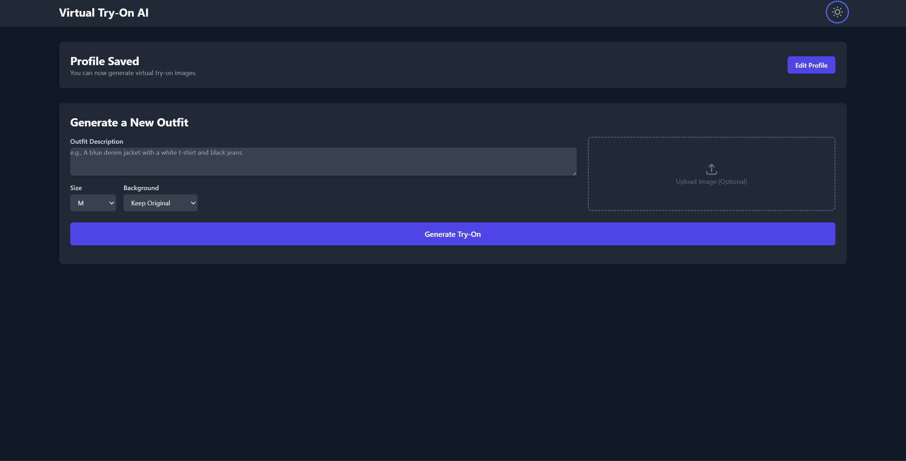

# Virtual Try-On AI

A web application that uses the Gemini API to generate virtual try-on images. Users can upload a photo of themselves, provide their physical details, and then describe or upload an image of an outfit to see a realistic depiction of them wearing it.

## Preview

| Profile Settings | Outfit Generation |
| :---: | :---: |
|  |  |


## Features

- **User Profile Creation:** Input age, height, weight, and a full-body photo to create a personalized model.
- **Outfit Generation:**
    - Describe an outfit with text (e.g., "a red floral dress").
    - Upload an image of an outfit.
- **Multiple Views:** The AI generates front, side, and back views of the user in the new outfit.
- **Background Options:** Choose to keep the original background or use a plain white one.
- **Dark Mode:** A sleek, themeable interface for user comfort.
- **Responsive Design:** Works seamlessly on desktop, tablet, and mobile devices.

## How It Works

This application leverages the powerful multimodal capabilities of Google's Gemini API (`gemini-2.5-flash-image-preview` model).

1.  The user provides their photo and physical attributes.
2.  The user provides an outfit, either as a text description or an image.
3.  The frontend packages this information into a multipart request.
4.  The request is sent to the Gemini API, which processes the user's image and the outfit details.
5.  The model generates new images, which are then displayed in the user interface.

## Getting Started

To run this project locally, follow these steps.

### Prerequisites

- A modern web browser.
- A local web server to serve the files. You can use the `live-server` VS Code extension or any other simple HTTP server.

### Environment Variables

This project requires a Google Gemini API key.

1.  Obtain an API key from [Google AI Studio](https://aistudio.google.com/).
2.  The application is configured to read the API key from `process.env.API_KEY`. You must ensure this environment variable is available in the environment where you run the application.

   **Important Security Note:** The current setup calls the Gemini API directly from the frontend. For a real-world application, you must **never** expose your API key on the client-side. The recommended approach is to create a simple backend (or a serverless function) that receives requests from your frontend, adds the API key securely on the server, and then forwards the request to the Gemini API.

### Installation & Running

1.  Clone the repository:
    ```bash
    git clone https://github.com/BenazizaAbdelkaderRiyadh/ai-outfit-checker.git
    ```
2.  Navigate to the project directory:
    ```bash
    cd ai-outfit-checker
    ```
3.  As this project uses ES modules directly in the browser via an import map, there is no build step required.
4.  Open `index.html` using a local web server.

